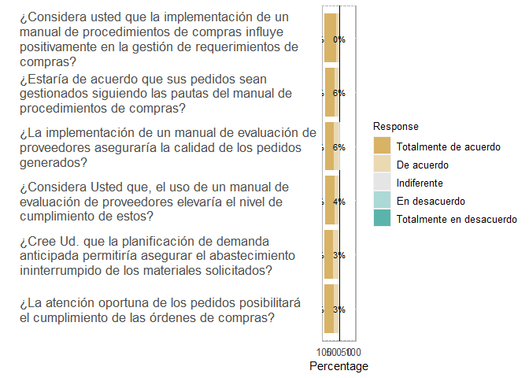
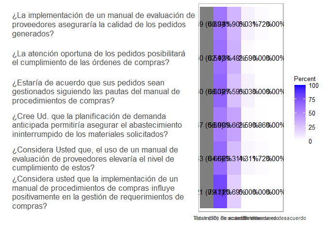
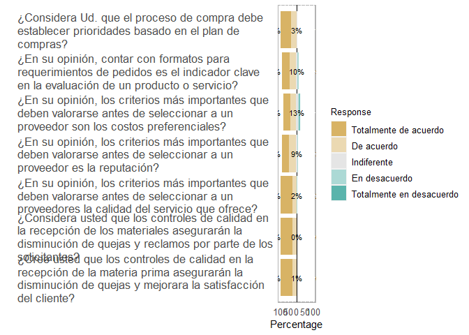
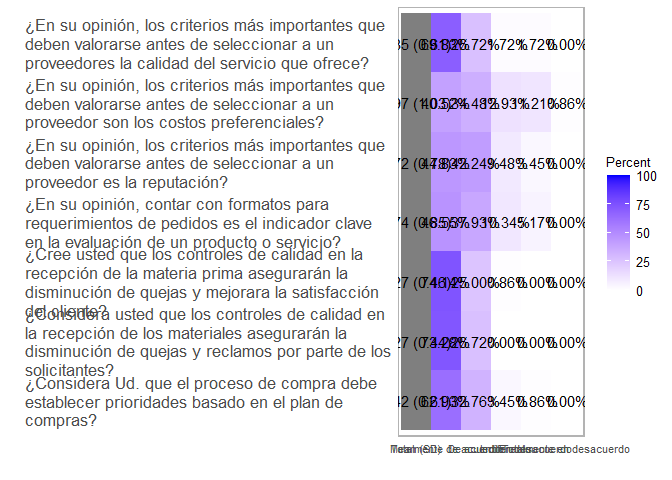
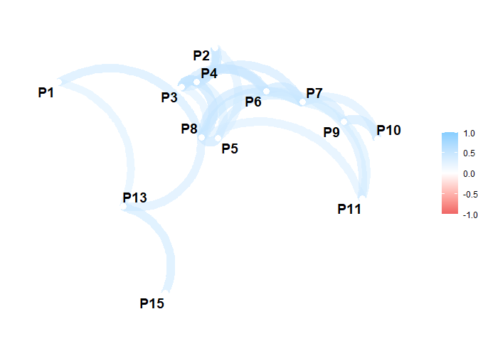
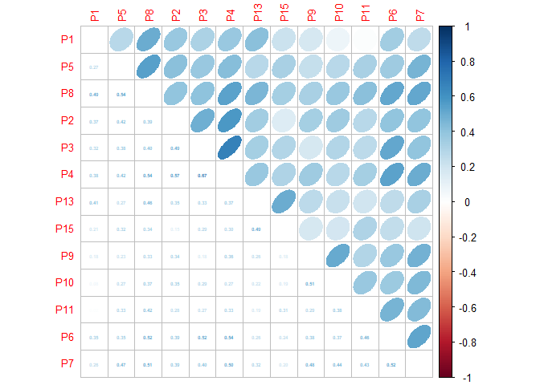

Análisis de Datos
================

## Carga y depuración de los datos

Carga de los datos y su correspondiente depuracion.

``` r
dataset <- read_excel("../Data/dataset-v3.0.xls")
dataset <- tbl_df(dataset)
```

    ## Warning: `tbl_df()` was deprecated in dplyr 1.0.0.
    ## Please use `tibble::as_tibble()` instead.
    ## This warning is displayed once every 8 hours.
    ## Call `lifecycle::last_lifecycle_warnings()` to see where this warning was generated.

``` r
dataset <- subset(dataset, !is.na(P3))
dataset <- subset(dataset, !is.na(P11))
dataset <- subset(dataset, !is.na(P14))

dataset <- subset(dataset, P9 != 'De acuerdo;Indiferente')
dataset <- subset(dataset, P9 != 'Indiferente;En desacuerdo')

niveles <- c('Totalmente de acuerdo', 'De acuerdo', 'Indiferente', 'En desacuerdo', 'Totalmente en desacuerdo')

dataset <-  dataset %>% 
  mutate(
    P1 = parse_factor(P1, levels = niveles),
    P2 = parse_factor(P2, levels = niveles),
    P3 = parse_factor(P3, levels = niveles),
    P4 = parse_factor(P4, levels = niveles),
    P5 = parse_factor(P5, levels = niveles),
    P6 = parse_factor(P6, levels = niveles),
    P7 = parse_factor(P7, levels = niveles),
    P8 = parse_factor(P8, levels = niveles),
    P9 = parse_factor(P9, levels = niveles),
    P10 = parse_factor(P10, levels = niveles),
    P11 = parse_factor(P11, levels = niveles),
    P13 = parse_factor(P13, levels = niveles),
    P14 = parse_factor(P14, levels = c('Muy frecuentemente', 'Frecuentemente', 'Ocasionalmente', 'Raramente'), ordered = T),
    P15 = parse_factor(P15, levels = niveles)
  )

summary(dataset)
```

    ##                         P1                            P2    
    ##  Totalmente de acuerdo   :92   Totalmente de acuerdo   :77  
    ##  De acuerdo              :24   De acuerdo              :32  
    ##  Indiferente             : 0   Indiferente             : 7  
    ##  En desacuerdo           : 0   En desacuerdo           : 0  
    ##  Totalmente en desacuerdo: 0   Totalmente en desacuerdo: 0  
    ##                         P3                            P4    
    ##  Totalmente de acuerdo   :70   Totalmente de acuerdo   :75  
    ##  De acuerdo              :37   De acuerdo              :34  
    ##  Indiferente             : 7   Indiferente             : 5  
    ##  En desacuerdo           : 2   En desacuerdo           : 2  
    ##  Totalmente en desacuerdo: 0   Totalmente en desacuerdo: 0  
    ##                         P5                            P8    
    ##  Totalmente de acuerdo   :66   Totalmente de acuerdo   :73  
    ##  De acuerdo              :46   De acuerdo              :40  
    ##  Indiferente             : 3   Indiferente             : 3  
    ##  En desacuerdo           : 1   En desacuerdo           : 0  
    ##  Totalmente en desacuerdo: 0   Totalmente en desacuerdo: 0  
    ##                         P6                            P7    
    ##  Totalmente de acuerdo   :73   Totalmente de acuerdo   :54  
    ##  De acuerdo              :38   De acuerdo              :44  
    ##  Indiferente             : 4   Indiferente             :12  
    ##  En desacuerdo           : 1   En desacuerdo           : 6  
    ##  Totalmente en desacuerdo: 0   Totalmente en desacuerdo: 0  
    ##                         P9                           P10    
    ##  Totalmente de acuerdo   :47   Totalmente de acuerdo   :52  
    ##  De acuerdo              :40   De acuerdo              :49  
    ##  Indiferente             :15   Indiferente             :11  
    ##  En desacuerdo           :13   En desacuerdo           : 4  
    ##  Totalmente en desacuerdo: 1   Totalmente en desacuerdo: 0  
    ##                        P11                           P13    
    ##  Totalmente de acuerdo   :81   Totalmente de acuerdo   :85  
    ##  De acuerdo              :31   De acuerdo              :31  
    ##  Indiferente             : 2   Indiferente             : 0  
    ##  En desacuerdo           : 2   En desacuerdo           : 0  
    ##  Totalmente en desacuerdo: 0   Totalmente en desacuerdo: 0  
    ##                        P15         P12                            P14    
    ##  Totalmente de acuerdo   :86   Length:116         Muy frecuentemente:61  
    ##  De acuerdo              :29   Class :character   Frecuentemente    :43  
    ##  Indiferente             : 1   Mode  :character   Ocasionalmente    :11  
    ##  En desacuerdo           : 0                      Raramente         : 1  
    ##  Totalmente en desacuerdo: 0

## Análisis del Alfa de Cronbach

A continuación, el análisis de cronback, con un 95% de confianza
(CI=TRUE).

``` r
bloque <- 1:13

data <- dataset[, bloque]
data <- lapply(data, as.numeric)

set.seed(123)

data <- as.data.frame(data)
datos_reducidos <- data %>% sample_frac(.1)
datos_reducidos <- replace(datos_reducidos, is.na(datos_reducidos), 0)

#calculate Cronbach's Alpha
cronbach.alpha(datos_reducidos, CI=TRUE)
```

    ## 
    ## Cronbach's alpha for the 'datos_reducidos' data-set
    ## 
    ## Items: 13
    ## Sample units: 12
    ## alpha: 0.901
    ## 
    ## Bootstrap 95% CI based on 1000 samples
    ##  2.5% 97.5% 
    ## 0.355 0.956

Se tomó el 10% de los datos de manera aleatoria, y con ese porcentaje se
calcula el alfa de Cronbach; el cual, sale 0.901 lo que me proporciona
una excelente medida de consistencia interna con respecto a la encuesta.

Cabe mencionar que solo se consideraron las preguntas que tienen escala
de Likert, que es la mayoría con la excepción de dos preguntas: una
tiene respuesta libre y otra tiene otra escala de valores ordinal.

## Análisis Descriptivo

You can include R code in the document as follows:

``` r
diccionario <- read_excel("../Data/diccionario.xlsx")
diccionario <- tbl_df(diccionario)

df_likert <- as.data.frame(dataset)
glimpse(df_likert)
```

    ## Rows: 116
    ## Columns: 15
    ## $ P1  <fct> Totalmente de acuerdo, Totalmente de acuerdo, Totalmente de acuerd~
    ## $ P2  <fct> Totalmente de acuerdo, De acuerdo, Totalmente de acuerdo, Totalmen~
    ## $ P3  <fct> Totalmente de acuerdo, De acuerdo, Totalmente de acuerdo, De acuer~
    ## $ P4  <fct> Totalmente de acuerdo, De acuerdo, Totalmente de acuerdo, Totalmen~
    ## $ P5  <fct> Totalmente de acuerdo, De acuerdo, Totalmente de acuerdo, De acuer~
    ## $ P8  <fct> Totalmente de acuerdo, Totalmente de acuerdo, Totalmente de acuerd~
    ## $ P6  <fct> Totalmente de acuerdo, Totalmente de acuerdo, De acuerdo, De acuer~
    ## $ P7  <fct> Totalmente de acuerdo, De acuerdo, De acuerdo, Totalmente de acuer~
    ## $ P9  <fct> Totalmente de acuerdo, Indiferente, De acuerdo, De acuerdo, De acu~
    ## $ P10 <fct> Totalmente de acuerdo, De acuerdo, De acuerdo, Totalmente de acuer~
    ## $ P11 <fct> Totalmente de acuerdo, De acuerdo, Totalmente de acuerdo, Totalmen~
    ## $ P13 <fct> Totalmente de acuerdo, De acuerdo, Totalmente de acuerdo, Totalmen~
    ## $ P15 <fct> Totalmente de acuerdo, Totalmente de acuerdo, Totalmente de acuerd~
    ## $ P12 <chr> "Su trayectoria", "Calidad, tiempos de entrega y tiempo de crédit~
    ## $ P14 <ord> Ocasionalmente, Muy frecuentemente, Frecuentemente, Muy frecuentem~

``` r
colnames( df_likert ) <- diccionario$descripcion

bloqueVI <- 1:6
bloqueVD <- 7:13

itemsVI <- likert( items = df_likert[ , bloqueVI ] )
itemsVD <- likert( items = df_likert[ , bloqueVD ] )
```

Análisis descriptivo de las variables independientes de la encuesta.

``` r
plot( itemsVI, centered = TRUE, group.order = colnames( itemsVI$items ),
      legend.position = "right" ) +
  theme( axis.text.x = element_text( size = 10 ),
         axis.text.y = element_text( size = 13, hjust = 0 ),
         legend.text = element_text( size = 10 ),
         legend.title = element_text( size = 10 ) ) 
```

<!-- -->

``` r
plot( itemsVI, type = "heat", group.order = colnames( itemsVI$items ) ) +
  theme( axis.text.x = element_text( size = 8 ),
         axis.text.y = element_text( size = 13, hjust = 0 ),
         legend.text = element_text( size = 10 ),
         legend.title = element_text( size = 10 ) )
```

<!-- -->

Análisis descriptivo de las variables dependientes de la encuesta.

``` r
plot( itemsVD, centered = TRUE, group.order = colnames( itemsVD$items ),
      legend.position = "right" ) +
  theme( axis.text.x = element_text( size = 10 ),
         axis.text.y = element_text( size = 13, hjust = 0 ),
         legend.text = element_text( size = 10 ),
         legend.title = element_text( size = 10 ) ) 
```

<!-- -->

``` r
plot( itemsVD, type = "heat", group.order = colnames( itemsVD$items ) ) +
  theme( axis.text.x = element_text( size = 8 ),
         axis.text.y = element_text( size = 13, hjust = 0 ),
         legend.text = element_text( size = 10 ),
         legend.title = element_text( size = 10 ) )
```

<!-- -->

## Análisis de Correlación

Se correlacionan las variables que tienen la escala de Likert.

``` r
glimpse(dataset[ , 1:13 ])
```

    ## Rows: 116
    ## Columns: 13
    ## $ P1  <fct> Totalmente de acuerdo, Totalmente de acuerdo, Totalmente de acuerd~
    ## $ P2  <fct> Totalmente de acuerdo, De acuerdo, Totalmente de acuerdo, Totalmen~
    ## $ P3  <fct> Totalmente de acuerdo, De acuerdo, Totalmente de acuerdo, De acuer~
    ## $ P4  <fct> Totalmente de acuerdo, De acuerdo, Totalmente de acuerdo, Totalmen~
    ## $ P5  <fct> Totalmente de acuerdo, De acuerdo, Totalmente de acuerdo, De acuer~
    ## $ P8  <fct> Totalmente de acuerdo, Totalmente de acuerdo, Totalmente de acuerd~
    ## $ P6  <fct> Totalmente de acuerdo, Totalmente de acuerdo, De acuerdo, De acuer~
    ## $ P7  <fct> Totalmente de acuerdo, De acuerdo, De acuerdo, Totalmente de acuer~
    ## $ P9  <fct> Totalmente de acuerdo, Indiferente, De acuerdo, De acuerdo, De acu~
    ## $ P10 <fct> Totalmente de acuerdo, De acuerdo, De acuerdo, Totalmente de acuer~
    ## $ P11 <fct> Totalmente de acuerdo, De acuerdo, Totalmente de acuerdo, Totalmen~
    ## $ P13 <fct> Totalmente de acuerdo, De acuerdo, Totalmente de acuerdo, Totalmen~
    ## $ P15 <fct> Totalmente de acuerdo, Totalmente de acuerdo, Totalmente de acuerd~

``` r
dfCor <- dataset[ , 1:13 ]
dfCor <- lapply(dfCor, as.numeric)
dfCor <- as.data.frame( dfCor )
corr <- cor( dfCor )

kable( corr,
       caption = "Tabla de correlaciones" )
```

|     |        P1 |        P2 |        P3 |        P4 |        P5 |        P8 |        P6 |        P7 |        P9 |       P10 |       P11 |       P13 |       P15 |
|:----|----------:|----------:|----------:|----------:|----------:|----------:|----------:|----------:|----------:|----------:|----------:|----------:|----------:|
| P1  | 1.0000000 | 0.3718193 | 0.3154829 | 0.3761188 | 0.2730506 | 0.4924336 | 0.3475509 | 0.2579752 | 0.1782198 | 0.0776789 | 0.0181838 | 0.4129234 | 0.2114454 |
| P2  | 0.3718193 | 1.0000000 | 0.4882379 | 0.5702267 | 0.4158278 | 0.3930795 | 0.3942242 | 0.3907076 | 0.3376300 | 0.3540008 | 0.2786811 | 0.3476396 | 0.1465132 |
| P3  | 0.3154829 | 0.4882379 | 1.0000000 | 0.6726875 | 0.3788961 | 0.4037602 | 0.5167301 | 0.3976411 | 0.1760475 | 0.2944096 | 0.2658483 | 0.3329401 | 0.2920601 |
| P4  | 0.3761188 | 0.5702267 | 0.6726875 | 1.0000000 | 0.4246179 | 0.5372760 | 0.5385625 | 0.4957293 | 0.3592873 | 0.2737765 | 0.3309879 | 0.3733288 | 0.3012653 |
| P5  | 0.2730506 | 0.4158278 | 0.3788961 | 0.4246179 | 1.0000000 | 0.5431952 | 0.3549276 | 0.4692760 | 0.2315479 | 0.2744179 | 0.3251259 | 0.2722867 | 0.3239250 |
| P8  | 0.4924336 | 0.3930795 | 0.4037602 | 0.5372760 | 0.5431952 | 1.0000000 | 0.5178411 | 0.5104569 | 0.3289395 | 0.3730894 | 0.4155391 | 0.4588659 | 0.3360495 |
| P6  | 0.3475509 | 0.3942242 | 0.5167301 | 0.5385625 | 0.3549276 | 0.5178411 | 1.0000000 | 0.5200244 | 0.3781348 | 0.3674484 | 0.4641201 | 0.2550181 | 0.2444823 |
| P7  | 0.2579752 | 0.3907076 | 0.3976411 | 0.4957293 | 0.4692760 | 0.5104569 | 0.5200244 | 1.0000000 | 0.4796271 | 0.4422930 | 0.4330268 | 0.3243068 | 0.2000063 |
| P9  | 0.1782198 | 0.3376300 | 0.1760475 | 0.3592873 | 0.2315479 | 0.3289395 | 0.3781348 | 0.4796271 | 1.0000000 | 0.5096736 | 0.2913476 | 0.2611900 | 0.1778288 |
| P10 | 0.0776789 | 0.3540008 | 0.2944096 | 0.2737765 | 0.2744179 | 0.3730894 | 0.3674484 | 0.4422930 | 0.5096736 | 1.0000000 | 0.3798650 | 0.2217758 | 0.1885047 |
| P11 | 0.0181838 | 0.2786811 | 0.2658483 | 0.3309879 | 0.3251259 | 0.4155391 | 0.4641201 | 0.4330268 | 0.2913476 | 0.3798650 | 1.0000000 | 0.1944734 | 0.3098451 |
| P13 | 0.4129234 | 0.3476396 | 0.3329401 | 0.3733288 | 0.2722867 | 0.4588659 | 0.2550181 | 0.3243068 | 0.2611900 | 0.2217758 | 0.1944734 | 1.0000000 | 0.4944419 |
| P15 | 0.2114454 | 0.1465132 | 0.2920601 | 0.3012653 | 0.3239250 | 0.3360495 | 0.2444823 | 0.2000063 | 0.1778288 | 0.1885047 | 0.3098451 | 0.4944419 | 1.0000000 |

Tabla de correlaciones

``` r
corr2 <- correlate( dfCor )
```

    ## 
    ## Correlation method: 'pearson'
    ## Missing treated using: 'pairwise.complete.obs'

``` r
kable( fashion( corr2 ),
       caption = "Tabla de correlaciones" )
```

| term | P1  | P2  | P3  | P4  | P5  | P8  | P6  | P7  | P9  | P10 | P11 | P13 | P15 |
|:-----|:----|:----|:----|:----|:----|:----|:----|:----|:----|:----|:----|:----|:----|
| P1   |     | .37 | .32 | .38 | .27 | .49 | .35 | .26 | .18 | .08 | .02 | .41 | .21 |
| P2   | .37 |     | .49 | .57 | .42 | .39 | .39 | .39 | .34 | .35 | .28 | .35 | .15 |
| P3   | .32 | .49 |     | .67 | .38 | .40 | .52 | .40 | .18 | .29 | .27 | .33 | .29 |
| P4   | .38 | .57 | .67 |     | .42 | .54 | .54 | .50 | .36 | .27 | .33 | .37 | .30 |
| P5   | .27 | .42 | .38 | .42 |     | .54 | .35 | .47 | .23 | .27 | .33 | .27 | .32 |
| P8   | .49 | .39 | .40 | .54 | .54 |     | .52 | .51 | .33 | .37 | .42 | .46 | .34 |
| P6   | .35 | .39 | .52 | .54 | .35 | .52 |     | .52 | .38 | .37 | .46 | .26 | .24 |
| P7   | .26 | .39 | .40 | .50 | .47 | .51 | .52 |     | .48 | .44 | .43 | .32 | .20 |
| P9   | .18 | .34 | .18 | .36 | .23 | .33 | .38 | .48 |     | .51 | .29 | .26 | .18 |
| P10  | .08 | .35 | .29 | .27 | .27 | .37 | .37 | .44 | .51 |     | .38 | .22 | .19 |
| P11  | .02 | .28 | .27 | .33 | .33 | .42 | .46 | .43 | .29 | .38 |     | .19 | .31 |
| P13  | .41 | .35 | .33 | .37 | .27 | .46 | .26 | .32 | .26 | .22 | .19 |     | .49 |
| P15  | .21 | .15 | .29 | .30 | .32 | .34 | .24 | .20 | .18 | .19 | .31 | .49 |     |

Tabla de correlaciones

``` r
network_plot( corr2, min_cor = 0.4 )
```

<!-- -->

``` r
corrplot.mixed( corr, tl.pos = "lt", diag = 'n', upper = "ellipse",
                number.cex = 0.4, tl.cex = 0.8,
                order = "hclust" )
```

<!-- -->
